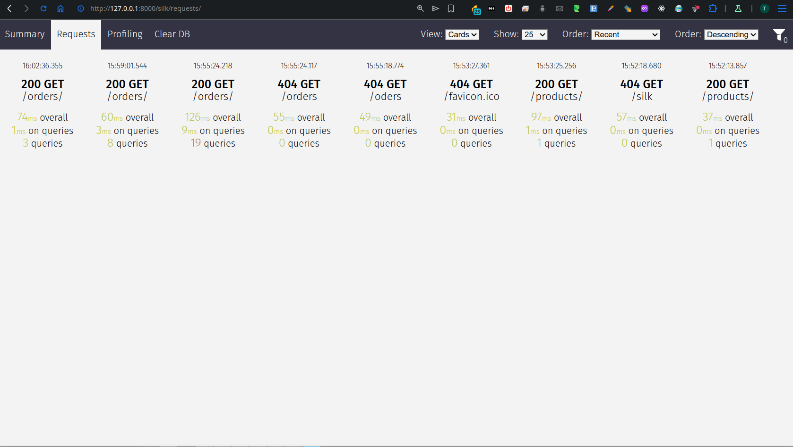

# django-rest-api
Django REST API 

## Models

To generate models ERD run:

```bash
uv run ./manage.py graph_models api > models.dot
```

## Django Silk

Django Silk is a Django middleware that provides a performance analysis tool for your Django application.

Here's a screenshot of the Silk dashboard after optimizing the db queries of Orders:


## Resources

- [Django REST Framework](https://www.django-rest-framework.org/tutorial/quickstart/)
- [BugBytes: Django REST Framework series](https://www.youtube.com/playlist?list=PL-2EBeDYMIbSXhV8FMC1hVD32Fi6e4l2u)
- [Django Graph Models command - Generate ER Diagrams for your Database](https://youtu.be/qzrE7cfc_3Q)
- [GraphViz generator](https://dreampuf.github.io/GraphvizOnline/)
- [Django Command Extensions](https://django-extensions.readthedocs.io/en/latest/command_extensions.html)
- [Django Graph Models](https://django-extensions.readthedocs.io/en/latest/graph_models.html)
- [ Django REST API Tutorial: The Ultimate Guide](https://www.moesif.com/blog/technical/api-development/Django-REST-API-Tutorial/)
- [Django REST Framework API Guide - Serializers](https://www.django-rest-framework.org/api-guide/serializers/)
- [Django Silk](https://github.com/jazzband/django-silk) - Silky middleware for Django to analyze and optimize performance.
